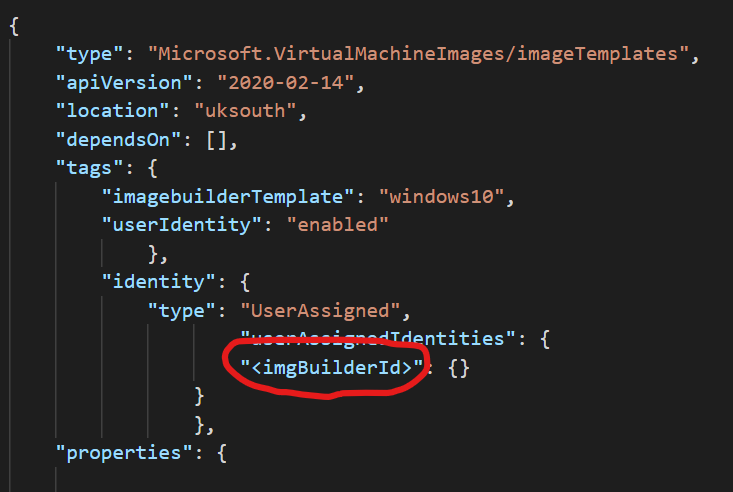

# **Azure Image Builder, Shared Image Gallery, Azure Files and DevTest Labs Demo**

# Contents
[Overview](#overview)

[Deployment](#deployment)

# Overview

The purpose of this Terraform module is to deploy various infrastructure components around Azure DevTest Labs to demonstrate how a developer might interact with and use the platform.

This module deploys a single vNET with two subnets, one for Bastion and one for VMs. A Shared Image Gallery is deployed which is used to distribute a Custom Image to that is built using Azure Image Builder. The Custom Image is built from Windows 10 Ent Gallery Image with Python and Git installed to demonstrate capability. A Storage Account is deployed with an SMB Share to be mounted on the Developer VM.

A DevTest Labs instance is deployed.

Note that this will store state locally, so a "backlend" block will need to be included to store state remotely.

# Deployment

Pre-requisites:

  - To use Azure Image Builder, you need to register the feature:

  `az provider show -n Microsoft.VirtualMachineImages | grep registrationState`
  
  `az provider register -n Microsoft.VirtualMachineImages`

Steps:
- Log in to Azure Cloud Shell at https://shell.azure.com/ and select Bash
- Ensure Azure CLI and extensions are up to date:
  
  `az upgrade --yes`
  
- If necessary select your target subscription:
  
  `az account set --subscription <Name or ID of subscription>`
  
- Clone the  GitHub repository:
  
  `git clone https://github.com/mattweale/azure-devtest-labs`
  
  - Change directory:
  
  `cd ./azure-devtest-labs`

  - Initialize terraform and download the azurerm resource provider:

  `terraform init`

- Now start the deployment (when prompted, confirm with **yes** to start the deployment):
 
  `terraform apply`

Deployment takes approximately 180 minutes, the vasy majority of this being the Image Build itself. If this timeouts the, the build timeout can be extended in the AIB JSON Config file [currently set to 240 minutes].

Currently Azure Image Builder is not supported in the AzureRM Provider. This has implemented using the local-exec provisioner and so Terraform does not maintain state. Before generating the Image Template, "sed" is used to substitute the Managed Identity in the JSON Config file ["<imgBuilderId>"] with the User Assigned Identity created by Terraform. If this script is subsequently run again, the Identity string needs to reverted back so the "sed" command does not fail:

## Explore and verify

After the Terraform deployment concludes successfully, the following has been deployed into your subscription:
  - A resource group named **rg-set-dev-demo** containing:
  - One vNET containing two subnets, AzureBastionSubnet and Subnet-One;
  - A Shared Image Library named **setSIG**;
  - An Image Defintion named **win10DevDesktop**;
  - A Managed Identity with Contributor RBAC on the RG [for Azure Image Builder];
  - A Storage Account **sadtldemo** with a File Share named **demo-share**
  - An instance of Bastion to provide connectivity to the DevTest Labs VMs.

## Backlog

A number of things aren't supported in the Terraform Provider or the Az CLI and will need to be manually for the time being, am investigating whether they are supported in PS that can be exectued with local-exec provisioner:
  - Attach Shared Image Gallery to DevTest Lab: DevTest Labs >> dlt-demo >> Configuration and Policies >> Shared Image Gallery >> Attach;
  - Add Virtual Network to DevTest Lab: DevTest Labs >> dlt-demo >> Configuration and Policies >> Virtual Networks >> Add;
  - Then need to add the Subnet to "Use in virtual machine creation";
  - Create Claimable VMs in DevTest Lab [Can demonstrate this live and include Artifacts like VSCode];
  - Will need to map network drive in VM, without AAD or AADDS Integration with Azure Files you use Storage Account name as username and primary key as the password. You can get the PS Script from Storage Accounts >> sadltdemo >> demo-share >> Connect:

  $connectTestResult = Test-NetConnection -ComputerName sadtldemo.file.core.windows.net -Port 445
if ($connectTestResult.TcpTestSucceeded) {
    # Save the password so the drive will persist on reboot
    cmd.exe /C "cmdkey /add:`"sadtldemo.file.core.windows.net`" /user:`"localhost\sadtldemo`" /pass:`<PrimaryKey>`""
    # Mount the drive
    New-PSDrive -Name Z -PSProvider FileSystem -Root "\\sadtldemo.file.core.windows.net\demo-share" -Persist
} else {
    Write-Error -Message "Unable to reach the Azure storage account via port 445. Check to make sure your organization or ISP is not blocking port 445, or use Azure P2S VPN, Azure S2S VPN, or Express Route to tunnel SMB traffic over a different port."
}

Verify these resources are present in the portal. Azure Image Builder deploys a number of resources to do the build, including a Storage Account and Container where the Packer Logs are [customization.log].

Credentials for the VMs are:
- User name: dev-user
- Password: Pa55w0rd123!

## Delete all resources

Delete the rg-set-dev-demo resource groups This may take up to 30 minutes to complete. Check back to verify that all resources have indeed been deleted.

In Cloud Shell, delete the azure-devtest-labs directory:

`rm -rf azure-devtest-labs`

## Notes

I have found AIB to fail intermittently, the customizations in the Image Build are minimal:
  - Powershell Customizer: Make Directory [buildActions, buildArtifacts, Python] & pipe some comments into txt file for demonstration purposes;
  - File Customizer: Get Winget [But do not install. File is in C:\buildArtifacts];
  - File Customizer: Get Python;
  - Powershell Customizer: Install Python and set path;
  - File Customizer: Get Git;
  - Powershell Customizer: Install Git and set path;

When the image build is running, logs are created, and stored in a storage account in the temporary Resource Group (RG), that AIB creates when you create an Image Template artifact.

- IT_<ImageResourceGroupName>_<TemplateName>_<GUID>

For example, this would be:

IT_rg-set-dev-demo_dtlWinDevDemo_251a920c-64c0-46c2-8604-36092f36f87c

Go to the RG > Storage Account > Blobs > packerlogs > click on the directory > customization.log

For a better understanding of the log, see here:

https://github.com/danielsollondon/azvmimagebuilder/blob/master/troubleshootingaib.md#understanding-the-customization-log 

As failures have been intermittent I have increased the size of the Build VM [to a Standard_D5_v2], increased the Build Timeout [to 300 mins] and
included a 60s PowerShell sleep customization. Indeed since adding the 60 sleep, have had 3 successful builds in a row! :-)